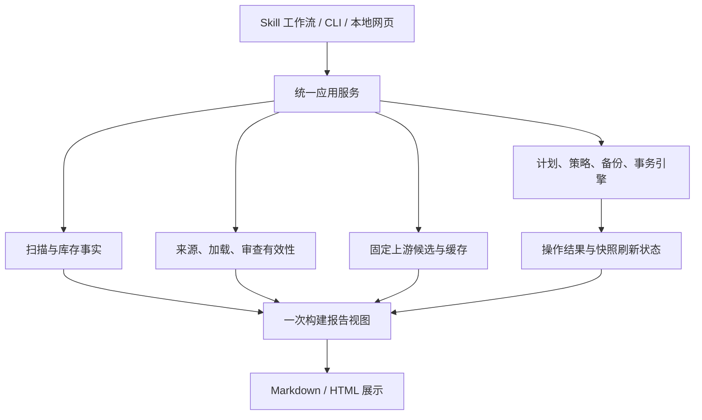

# Skill-Keeper 全面审查与优化建议

审查日期：2026-09-06。基线：`9c5c5eb`；业务代码与 v4.0.0 发布提交 `166d1a9` 相同。

## 结论

**值得继续迭代，当前最需要的是修通工作流、合并重复的事实与规则来源，再优化已测出的热点。**

项目有扎实的安全设计：固定候选、不可变计划、内容校验、备份、事务状态、失败回滚，以及不自动执行模型建议。但这些机制没有完整贯穿所有入口。部分“已实现”能力只存在于单独模块或测试里，生产报告、网页和 CLI 仍走旧逻辑。

因此，不能据目前测试全绿就认定用户工作流可靠；也不应以追求“性能最高”为由先删掉事务、备份、校验。最合适的目标是：**常用操作响应快，错误状态真实可见，所有入口共享同一套决定，并且复杂度与实际风险相称。**

本次是审查交付，没有修改业务代码、真实 Skill、个人配置或运行态库存；未执行提交、推送或发布。删除、更新、回滚探针全部使用临时目录。真实 HOME 只做只读扫描，公共 GitHub API 只做只读请求。

## 验证范围与证据

- 阅读扫描、报告、更新检查、审查队列、CLI、网页服务、路径解析、客户端适配、策略、指纹、备份及事务关键实现，交叉核对现行架构文档与对应测试。
- 本机执行 `python3 scripts/verify.py --json`：313 项测试，0 失败、0 错误、0 跳过，耗时 20.886 秒；233 个冻结测试 ID 全部保留，附加检查通过。
- 对报告实际导出的 JavaScript 做 Node 语法检查。
- 使用隔离 fixture 复现主要边界问题；公开 API 核对 GitHub 的真实响应结构。
- 使用当前 HOME 和项目现有的密集相似度测试语料分别测量性能。
- 本次执行环境：macOS 26.6.2 / arm64 / Python 3.9.6；JavaScript 检查使用 Node 24.14.0。没有重新执行 Windows/Linux 的平台测试，也没有把已有 CI 记录当成本轮实测。
- 没有执行完整浏览器点击回归；网页语法问题由最终输出脚本的解析失败直接确认，接口流程由隔离探针确认。

证据文件：`measurements.json`、`probe-results.json`、`more-probe-results.json`。探针打印当前行为，用于复核本报告，并非新增的通过/失败验收测试。

优先级：P1 = 优先修复的可靠性、核心可用性或显著性能问题；P2 = 条件触发的错误或下一阶段优化。不同问题之间没有依赖时可以独立处理，序号不代表唯一执行顺序。

## 主要发现

### F01 / P1：报告 JavaScript 语法错误，整段交互不能加载

位置：`scripts/report.py:541`、`:544`，`JS_BLOB`。

Python 三引号字符串中的 `\n` 被解释为真实换行，再嵌入 JavaScript 单引号字符串，最终变成非法 JS。删除与恢复分支使用了双重转义，更新分支没有保持一致。

**实测：**把 `JS_BLOB` 导出后执行 `node --check`，退出码 1；导出脚本第 62 行报 `SyntaxError: Invalid or unexpected token`。

影响并不限于更新按钮：浏览器先解析整段脚本，失败后自定义跳转、复制、删除、恢复、更新、忽略等事件处理都不能注册。原生 HTML 的折叠等功能仍可能可用。

建议：把 JavaScript 移到真实 `.js` 资源，静态与服务模式复用同一份，并纳入安装包资源。增加最终产物语法检查，以及最小的浏览器点击测试。不要只断言 HTML 中存在按钮或 `fetch` 字样。

### F02 / P1：GitHub 下载器不兼容正常 API 响应

位置：`scripts/core/github.py:172-180`、`:209`。

存在两个独立缺陷：

1. 正常递归树包含 `type=tree` 的目录条目，当前代码把一切非 `blob` 条目都拒绝；带 `scripts/`、`references/` 等子目录的 Skill 无法正常物化。
2. 直接对 GitHub 返回的 Base64 执行 `validate=True` 解码，不能接受其换行格式。

**实测：**正常目录 fixture 返回 `unsupported-tree-entry`；带换行的 Base64 返回 `blob-error: Error`；不含目录、Base64 不换行的控制组成功。本项目公开仓库 `166d1a9` 的真实 API 响应有 162 个树条目，包含 `tree` 与 `blob`；`SKILL.md` 的 20,417 字节内容对应的 Base64 有 454 个换行。

GitHub 官方文档明确区分普通文件、目录和 submodule，递归参数会返回子树对象：[Git Trees API](https://docs.github.com/en/rest/git/trees?apiVersion=2022-11-28)。Blob 接口提供 Base64 JSON，也支持原始内容媒体类型：[Git Blobs API](https://docs.github.com/en/rest/git/blobs?apiVersion=2022-11-28)。

建议：合法目录条目应参与结构验证，submodule 等不支持类型继续明确拒绝；Base64 仅规范化协议允许的空白后再严格解码，或使用 raw 响应。保留大小、链接父级、路径及候选哈希校验。补充真实协议形状的脱敏 fixture，尤其不能只用全部为 blob、Base64 无换行的理想样本。

### F03 / P1：审查过期模块没有接入报告，会保留已经失效的删除建议

位置：`scripts/report.py:161-186`、`:306-310`；`scripts/core/review_state.py:43`；`scripts/core/reviews.py:95-106`。

`evaluate_review()` 能判断目标内容变化、替代品变化或消失、历史快照缺失等状态，但报告没有调用它。报告仍按随内容改变的 `logical_id` 连接记录，只粗略比较目标哈希；队列也自行计算另一套有效性。

**实测：**审查时建议删掉 demo、保留本地 alt，随后删除 alt：核心有效性模块返回 `needs-recheck`，报告却返回 `stale=false`，继续显示“建议删除”和 `安检 safe`。目标自身内容变化时，旧结论直接从价值分组消失，被当成全新未审查对象，不能按承诺展示历史。

影响：用户会依据已经不成立的替代关系做决定。这比普通显示错误更值得优先处理。

建议：所有消费方统一调用有效性模块，以稳定实例身份连接历史，以内容版本和依赖快照判断当前效力。目标内容未变、仅替代关系失效时，可区分“内容安检仍有效”和“删除建议已失效”；不要用单一绿色标记把两者混在一起。

补充：`record_review()` 为受保护替代品读取快照时只看待审队列，而受保护品不会进队列，容易记录空替代品哈希。应从全量安装索引取依赖快照。

### F04 / P1：备份路径没有统一，新安装的删除—展示—恢复链路会断开

位置：`scripts/core/runtime.py:76-105`；`scripts/serve.py:42-62`；`scripts/report.py:959-979`；`scripts/check_updates.py:31-42`。

**隔离的新安装实测：**

| 消费方 | 默认备份位置 |
|---|---|
| CLI / `RuntimePaths` | `~/.skill-keeper/backups` |
| 网页 `ServiceContext` | `~/.skill-keeper/data/backups` |
| 报告 `backups_list()` | 固定读取代码根目录下 `backups/` |

因此，备份可能真实存在，但报告不列出；一个入口创建的备份，另一个入口按其 ID 恢复时找不到。当前旧仓库布局恰好掩盖了这个问题。

另有路径漂移：新默认宣称 staging 在 `~/.skill-keeper/cache/staging`，独立更新检查却使用平台旧缓存目录。本机复现为 `~/Library/Caches/skill-keeper/staging`。

建议：启动时只解析一次 `RuntimePaths`，显式传递给 CLI 服务、网页服务、报告视图和更新检查。将路径解析从各入口删除，而不是再增加一层 fallback。验收必须从“新安装、仓库外运行、无历史 data”开始，真实完成删除、报告中找到备份、恢复。

### F05 / P1：恢复入口没有拿变更锁，未完成事务也只阻断同一计划

位置：`scripts/core/changes.py:642-667`、`:734-750`；`scripts/manage.py:69-75`。

`apply_plan()` 使用 `.change.lock`，但 `recover_transaction()` 直接移动或清理文件，没有取得这把锁；管理 CLI 同样没有补锁。

**实测：**外部已持有 `.change.lock` 时，恢复接口依然把临时 fixture 中的保管目录移回原位，返回 `rolled-back`。这意味着恢复可以与另一个正在执行的变更重叠。

另一个隔离状态探针写入某旧计划的 `recovery-required`，随后新建计划删除同一库存目标，仍然成功。执行器只查看当前 `plan_id` 的历史事务，没有检查其他未完成事务及其目标占用。

影响：事务机制的互斥约束没有覆盖所有写入口；真实竞态的最终破坏结果取决于执行顺序。本次确认的是约束可绕过，没有把模拟状态说成真实用户数据损失。

建议：所有恢复与执行操作共用同一把锁。锁内核对未完成事务，至少阻断目标路径、保管路径及父子路径有交集的后续写；若按现行合同全局阻断，也应明确实现。扫描不应把本工具的事务保管目录当作普通已安装 Skill。无需为此引入分布式锁服务。

### F06 / P1：变更已提交，刷新超时却把成功操作报成失败

位置：`scripts/core/runtime.py:128-144`；`scripts/core/service.py:101-115`；`scripts/serve.py:279-281`。

`publish_snapshot()` 只检查子进程退出码，没有处理 `TimeoutExpired` 和启动失败。异常发生在 `apply_plan()` 已经提交之后，直接逃出服务层；网页端会把它转成通用失败消息。

**实测：**临时 demo 真实删除、事务为 `committed`，模拟后续扫描超时，`AppService.apply_action()` 却抛出 `TimeoutExpired`，没有返回承诺的 `snapshot_status=stale`。

Python 官方文档确认 `subprocess.run(timeout=...)` 超时会抛出异常，而不是返回可检查的退出码：[subprocess 超时行为](https://docs.python.org/3/library/subprocess.html#subprocess.run)。

建议：提交结果和刷新结果分别建模。刷新遇到任何预期失败仍应返回真实提交结果，并显式标出报告过期；前端展示这个状态。单独提供重试刷新，避免诱导用户再次执行资产操作。

相关问题：网页旧版 `run_scan_report()` 使用环境默认值，没有继承创建服务时显式传入的路径，并把退出码 1 的“扫描完成但有红灯”也当作运行失败。

### F07 / P1：审查队列实际存在近立方级工作量，现有性能测试没有检测它

位置：`scripts/core/reviews.py:172-183`；`scripts/core/overlap.py:221-243`。

每个逻辑 Skill 调用 `_similar_for()`，每次都让 `candidate_pairs()` 遍历全库两两组合，构建候选字典并排序，最后只取本 Skill 的前 8 个。评分虽只做一次，后续全库扫描、分配、排序又重复 N 次。

即使没有候选过阈值，重复遍历也有 O(N³) 工作量；密集候选下还伴随大量对象分配与排序。索引保存所有配对，内存为 O(N²)。

**项目现有语料扩容实测：**

| 逻辑 Skill 数 | 单独建索引 | 完整队列 | 进程峰值 RSS |
|---:|---:|---:|---:|
| 80 | 0.015 秒 | 0.150 秒 | 28.7 MiB |
| 200 | 0.087 秒 | 2.912 秒 | 54.4 MiB |
| 400 | 0.381 秒 | 39.752 秒 | 148.6 MiB |
| 800 | 未单独记录结果 | 进程运行约 6 分钟仍未完成，主动中止 | 中止前观测约 510 MiB |

800 行不是完成耗时或精确峰值。其他结果为单次观测，语料沿用 `OverlapCostTests._inventory_n`，共同描述较多，属于相似候选密集场景，不能套用到所有用户。

200 项的另一次 profiler 测量：总计 4.556 秒，`_similar_for` 累计 4.285 秒，约占 94%；`candidate_pairs()` 被调用 200 次；真正建索引只占 0.143 秒。性能方向非常明确。

建议：一次生成候选，再按两端 logical ID 建邻接表；每个 Skill 只访问自身候选，统一排序一次或维护固定数量的最佳候选。第一阶段保留评分和冻结基线语义，先消掉重复遍历。确认新基线后再考虑只保存必要配对，或用有可验证召回保证的倒排索引缩小候选域。不要先用多进程掩盖算法问题。

### F08 / P1：错误形状的保护配置会静默降级成“未知”，允许写入

位置：`scripts/core/policy.py:41-57`。

代码拒绝语法损坏和错误顶层结构，但把内部非字典条目直接改成 `{"type":"unknown"}`，仍保持 `healthy=true`。

**实测：**仅通过 `known-sources.json` 保护 demo，误写成 `{"demo":"self-built"}` 时，策略返回健康，并允许删除该目标；若另有正确的 `self-built.txt` 登记，则该额外保护仍然生效。

影响：用户配置的类型错误被当成放开保护，违反“已存在但损坏的保护配置拒绝写”的项目规则。

建议：保护配置做统一 schema 验证，非法条目报出来源及条目位置，并阻止写入；可保留只读盘点能力。需要兼容历史配置时，应有明确的迁移规则，不能在策略判定时静默抹掉语义。

### F09 / P2：网页更新流程缺少绑定当前计划的安检步骤

位置：`scripts/report.py:535-545`；`scripts/core/changes.py:239-278`；`scripts/manage.py:88-128`。

安检记录绑定 `plan_id + candidate_hash` 是合理的；但按钮每次创建一个新 plan，随后直接 apply。网页没有为这个新计划记入安检记录的阶段，CLI 也没有现成的 vet 子命令。

**实测：**同一候选已对计划 A 安检，网页再次创建计划 B 后立即执行，仍报“候选尚未安检”。即使修好 F01，此流程依旧会卡住。

建议：串成可续办的“候选审查 → 建立/查看固定计划 → 对该计划记账 → 用户确认 → 执行”流程，或者先建立固定计划、再审查并继续同一计划。提供正式 CLI/API 来提交安检记录。不要去掉 plan/hash 绑定以换取按钮能用。

### F10 / P2：加载统计存在多套口径，跨项目重复与旧插件版本会误报

位置：`scripts/scan.py:448-470`、`:498-520`；`scripts/core/observations.py:25-66`；`scripts/report.py:561-584`。

**实测一：**两个不同项目各装一个同名 Skill，在不选工作区的全局扫描中，旧 `client_load` 统计为 2 条并产生重复告警；新 `load_contexts` 却正确表示 eligible=0。报告仍主要消费旧统计。

**实测二：**插件缓存有 1.0、2.0 两个版本，旧统计经过版本筛选为 1 条，新 `load_contexts` 却统计为 2 条。

影响：用户可能为了消除并不存在的“双载”而清理正常的项目配置。建议合并有效版本、工作区范围、自报根关系及加载证据评估为同一个模型，报告与 JSON 摘要只负责展示。

### F11 / P2：不完整观察在部分入口仍被表示为成功

位置：`scripts/scan.py:256-296`、`:768-783`；`scripts/report.py:1015-1022`；`scripts/check_updates.py:263-281`。

已复现三种不一致：

- `client-locations.json` 语法损坏进入 `config_issues`，但 `observation.complete=true`、`health_status=ok`，受影响的额外根可能被漏扫。
- inventory 明确标记 `observation.complete=false` 时，报告 `--json` 仍输出 `operational_ok=true`，没有红灯则退出 0。
- inventory 缺失时，更新检查退出 2，但先把旧的有效 updates 覆盖成空结果，与同段注释“不得覆盖已有成功结果”相反。

建议：分开“本次运行失败”“观察不完整”“扫描成功但有健康问题”“没有安装任何 Skill”。成功数据快照和本次运行状态分开保存；错误不能伪装成空集合，也不能悄悄清空上一份可用结果。

### F12 / P2：更新计划使用新磁盘哈希，回滚却使用旧库存哈希

位置：`scripts/core/changes.py:153-165`、`:808`。

**复现步骤：**先扫描 → 用户修改本地内容 → 为当前内容生成更新计划 → 注入更新后业务校验失败。

计划正确绑定了修改后的磁盘哈希，实际回滚也正确恢复了这些内容，但事务的 `original_hash` 仍来自旧 inventory。复核时于是误报 `recovery-required`，与错误消息“已回滚到旧版本”不一致。

建议：生成执行状态时使用已确认的前置条件哈希或本次已验证备份的哈希，不能再混用过期快照。验收应确认磁盘恢复和事务终态同时正确。本次未观察到该路径丢失文件，确认的是虚假恢复告警。

### F13 / P2：扫描有重复 I/O，空指纹又被合并成同一逻辑身份

位置：`scripts/scan.py:349-368`、`:610-631`；`scripts/core/fingerprint.py:54-115`、`:147-152`。

**重复 I/O：**同一 Skill 通过多个客户端符号链接出现时，正文和整树指纹会重复计算。单文件 fixture 的两个入口哈希读取 2 次；真实 HOME 一次带计数扫描调用 3,785 次文件哈希，只涉及 2,631 个唯一真实文件，共读取约 438 MiB。带 profiler/计数器耗时 1.049 秒，普通扫描另测为 0.760 秒，不能混用二者比较优化收益。

**身份错误：**无法取得完整指纹的对象都得到空串，`_build_logical_skills` 按这个空串合并。三个不可读实例、包含不同名字的 fixture 最终只剩一个逻辑条目。

**指纹边界：**改变 Skill 根目录自身权限不会改变 `tree_hash`；子文件/子目录权限会参与。若继续宣称“全部权限变化都会反映在指纹”，需要把根元数据纳入合同，或明确另行校验。

建议：单次只读扫描按真实内容根复用指纹与元数据，客户端读取关系独立保留；空哈希对象按稳定实例隔离，不能推断内容相等。跨次缓存另需失效策略，apply 前仍做真实内容验证，不把 mtime 缓存升级为安全依据。

## 其他性能与体验问题

### 更新缓存实质上主要是失败回退

`cached_repo_snapshot()` 每次都请求网络；同一仓库在同一轮中的多个 Skill 会重复请求仓库、HEAD、release、contributors。`stage_candidate()` 先完整下载到临时目录，才发现相同候选已经存在。

隔离计数：同一仓库连续两次取快照各请求 4 次；同一个单文件候选连续暂存两次，各请求 2 次。F02 修复后，这个成本才会完整暴露给实际用户。

建议先做单轮按 repo 去重；不可变内容按 `(repo, commit, source_dir)` 或 Git 对象身份复用，并在使用时验证缓存。热度信息按独立刷新周期更新，不应该阻塞核心更新检查。之后才考虑少量有界并发与失败重试；无需整个应用异步化。

### 备份展示会重验所有归档，而不是只验要展示的 30 个

`backups_list()` 遍历并验证全部候选备份，最后才 `[:30]`。归档累积后，打开报告的成本与历史备份总字节数相关。创建备份还对单文件 `read_bytes()`，内存与最大文件大小相关，资源上限检查主要发生在之后的验证阶段。

本机现有 12 个新格式归档的列表实测只有 0.019 秒，**这不是当前机器的主要瓶颈**。建议流式打包并提前校验限额；展示使用已验证 manifest/目录索引，恢复前重新完整验证。优化顺序低于 F07，不能用缓存跳过执行前校验。

### 报告数据与计算尚未完全分离

`render_html()` 内部仍读取全局 `groups.json`；报告会探测本机应用，备份列表也来自全局 BASE。传入 fixture inventory 并不保证渲染只依赖 fixture。Markdown 和 HTML 又分别构建视图。

建议由服务层收集所有输入，一次构建 view，两个渲染器只消费 view。此举有助于减少重复工作，更能避免新旧路径和真实环境混入测试。

### Skill 入口仍带着私人部署和旧版本假设

当前 `SKILL.md` 有约 20 KB，标题仍是 v2，命令固定使用 `~/skill-keeper`，部分数据路径、退出码和更新步骤没有同步到 v4。统一 CLI 只公开 scan/report/manage/doctor；更新检查、价值审查、候选安检仍需要知道内部脚本或 Python 函数。

`_need_vet()` 主要根据来源是否第三方生成列表，没有消费已经有效的审查记录。队列也包含已审对象，却一概打印为“待审查”。如果模型遵循“看到待安检就逐个全部审完”，会产生不必要的模型调用、等待和上下文消耗。

建议：Skill 首页只保留环境定位、任务路由、必要授权边界、错误处理及交付约定；细节下沉参考文档。正式 CLI 补齐更新、审查和候选记账入口。普通体检只处理新增、变化或依赖失效的项，完整价值评估作为明确工作模式。

## 架构判断：哪些应保留，哪些应收敛

### 应保留的复杂度

- **不可变计划与明确确认**：把模型建议和真实文件变更分开，有实际价值。
- **完整内容校验**：能发现正文以外脚本、模板和链接的变化。
- **可验证备份、事务保管、回滚与断点恢复**：删除和更新涉及用户资产，这些保护不是无意义负担。
- **本机位置确认与只读模型声明的区别**：输入信任边界清楚，适合 Agent 驱动工具。
- **运行时仅标准库**：对本地 Skill 分发有益，当前没有证据支持换语言或引入大型框架。

### 应收敛的复杂度

| 重复/漂移 | 目前后果 | 目标 |
|---|---|---|
| `AppService` 与网页旧 `_handle_plan` / `run_scan_report` | 路径、错误和行为不一致 | CLI 与 HTTP 只做参数转换，统一调用服务 |
| 新旧加载模型、规则表与手写条件 | 工作区/版本统计互相矛盾 | 一份加载评估结果，多处展示 |
| `evaluate_review` 与报告/队列手写过期判断 | 安全模块存在但实际建议失效 | 一份有效性判定 |
| `RuntimePaths` 与入口自己的默认值 | 新安装备份不可见 | 运行时显式注入统一路径 |
| 字典 payload 与并未贯穿的 dataclass | 多次 `get/default` 掩盖漏字段 | 在边界统一校验，核心数据形状明确 |
| 报告模块同时负责读文件、推断状态、组装视图、HTML/CSS/JS | 改文案也可能破坏脚本与行为 | 输入收集、view、展示资源分离 |
| 历史兼容分支散落在正常流程中 | 私人旧布局通过，新安装失败 | 兼容解析集中在入口/迁移适配处 |

建议的概念结构如下；它不要求新增六套框架或大量接口类：



原则：**事实算一次，规则判一次，入口尽量薄，展示不做决定。** 模块数量本身不是优雅程度；这里的主要问题是同一规则有多份实现，而非文件数量过多。

## 建议的执行顺序与验收

### 第一阶段：先修通用户真正走的路径

处理 F01–F06、F08，并修通 F09 的固定计划安检续办。

验收重点：

- 安装后的实际报告脚本解析成功；浏览器能跳转、复制并完成受支持动作。
- 合法 GitHub tree + 换行 Base64 + 子目录 + 可执行文件能得到确定候选；恶意路径仍拒绝。
- 新安装状态，从 CLI 删除，在报告看到同一备份，再从网页/CLI 恢复；显式 data/backup/staging 路径也成立。
- 恢复遇到被持有的锁会拒绝或等待；未解决事务不会被新计划交叉覆盖。
- 变更成功后注入扫描超时、报告异常，用户仍收到 `committed + stale`，可单独刷新。
- 删除已采用替代品后，旧删除建议立即失效；目标变化后历史仍可见。

### 第二阶段：修正数据口径并减少维护成本

统一 RuntimePaths、AppService、LoadEvaluation、ReviewEvaluation；集中配置校验与错误状态；修 F10–F13；让渲染器只消费 view。

验收看“同一数据在 CLI、网页、报告中的结果是否一致”，不看是否又多写了一个正确的辅助函数。旧格式兼容要明确测试一组，新默认布局也独立测试一组。

### 第三阶段：定点优化性能

先消除 F07 的重复全库遍历，其次是同轮指纹复用、GitHub 仓库/候选复用，最后处理大归档和展示开销。

建议把以下数字作为**待实测校准的验收目标，而不是本轮已经实现的性能承诺**：

- 保持当前约 100 项库的本地扫描、普通报告交互在秒级。
- 当前 400 项密集语料队列从约 40 秒降到 2 秒量级；800 项有明确耗时和内存上限。
- 性能测试同时包含稀疏候选和密集候选，记录整个命令耗时、峰值内存、文件读取量、网络调用数及候选遍历量。
- 固定语料的候选分数、理由与稳定排序保持一致；如有意改变召回语义，先定义新的质量验收，不为提速偷偷少做工作。
- 资产写操作继续完整验证真实内容，不用展示缓存替代。

### 第四阶段：精简 Skill 的使用体验

统一面向 Agent 的命令与结构化返回；默认快扫与增量复核；完整价值审查、联网更新检查、真实变更清晰区分。只展示完成任务必需的步骤和恢复办法，让模型无需了解内部 Python 文件结构。

目前不建议更换语言、改成微服务、增加常驻文件监控服务、先上数据库或大规模异步化。等上述热点消除后，再按真实工作量决定是否需要这些手段。

## 为什么测试全绿仍然遗漏这些问题

并非测试数量不够，而是部分测试没有真正经过它承诺覆盖的入口：

1. 前端测试多验证字符串和 HTML 标签，没有解析最终 JS，F01 因而未被发现。
2. GitHub fixture 主要是理想化 blob 数组和无换行 Base64，与真实服务有偏差。
3. `evaluate_review` 的测试验证辅助函数正确，却没有验证报告和队列调用了它。
4. `tests/test_workflow_contract.py:70` 的备份测试调用了真实 `backups_list()`，随后没有使用该返回值，而改用 `_backups_from_real_dir(paths)` 取得正确目录下的备份，所以无法发现报告读错路径。
5. 同文件 `:48` 的“刷新失败”测试，在 mock 刷新失败后只调用 `plan_action('restore')`，没有实际 apply 到刷新阶段，未覆盖超时或提交后错误。
6. 性能测试只计正文读取和评分次数，没计每个目标重复扫描/构建/排序配对结果的成本。
7. 事务中断测试有价值，但未完成“恢复与 apply 争同一把锁”“另一计划遇到未解决事务”的并发合同。

保留现有冻结测试 ID，在对应位置补实际断言和完整入口回归。不要继续把测试数量或“某模块存在”当成能力闭环的替代指标。

## 如何复核

从本仓库运行：

```bash
python3 docs/reviews/2026-09-06/probes.py
python3 docs/reviews/2026-09-06/more-probes.py
python3 docs/reviews/2026-09-06/benchmark.py --sizes 80 200 400 --timeout 90
```

前两个脚本只修改临时 fixture。性能脚本每个规模用独立进程并限制运行时间；与本机其他负载、Python 版本、语料和缓存状态有关，不应把单次数字当成所有机器的 SLA。

对最终前端脚本的原始复核：从 `scripts.report` 导出 `JS_BLOB` 至临时 `.js` 文件，执行 `node --check`。本轮导出脚本第 62 行解析失败；业务源码位置为 `scripts/report.py:541`。
